<div align="center">

# SkyHub

**A community-owned, self-hostable audio-samples platform** — browse, preview, organize,
and drag straight into your DAW. Two native instruments (web + VST3/CLAP) on one shared DSP core.

[](https://github.com/SkyCloudCollective/skyhub/actions/workflows/ci.yml) [](LICENSE) [](SELFHOST.md) [](#surfaces) [](CONTRIBUTING.md)

</div>

This is the **v2 re-foundation**: a clean monorepo with one source of truth per concern.
It supersedes the v1 prototype, keeping what was proven (the audio analyzer, the catalog
schema, the auth model, the drag research) and rebuilding what had accumulated cruft (a
duplicated backend, a monolithic frontend, and a forked DSP).

## Screenshots

<div align="center">

**The library** — browse, search, preview, and drag a sample straight into your DAW.


</div>

| | |
|:--|:--|
|  |  |
| **Studio** — two native instruments (Morph, PhasePlan) in an AudioWorklet | **Galaxy** — the library plotted by timbre (brightness × percussiveness) |
| 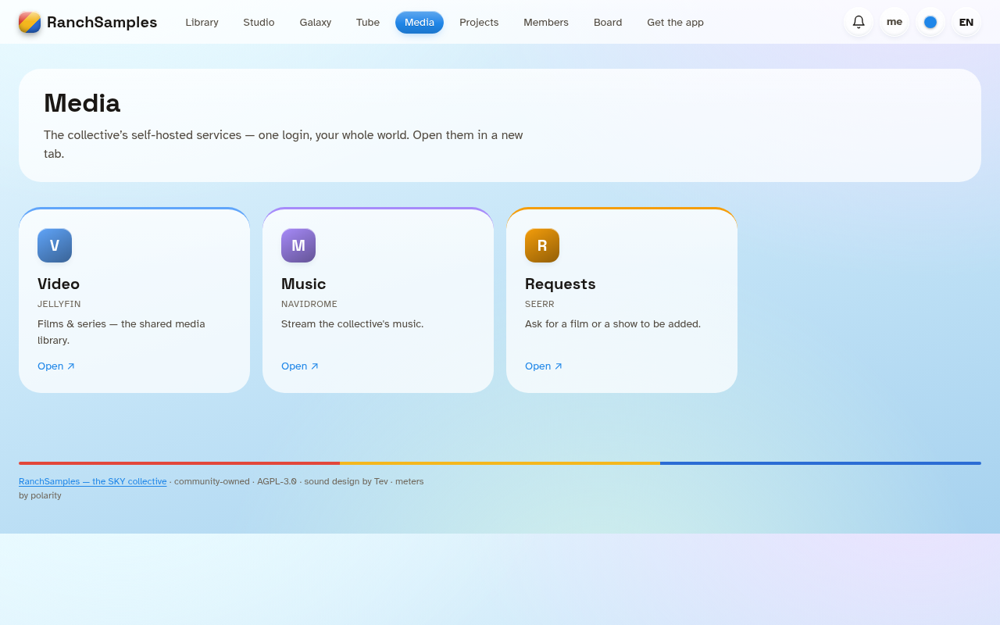 | 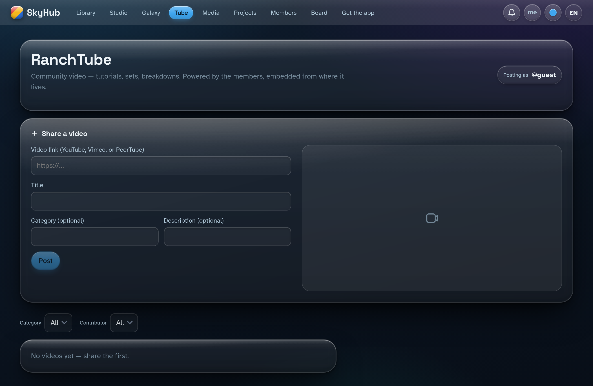 |
| **Media** — one login to the collective's self-hosted services | **Tube** — the community video wall |

**Light + dark, on every surface:**

| | |
|:--|:--|
| 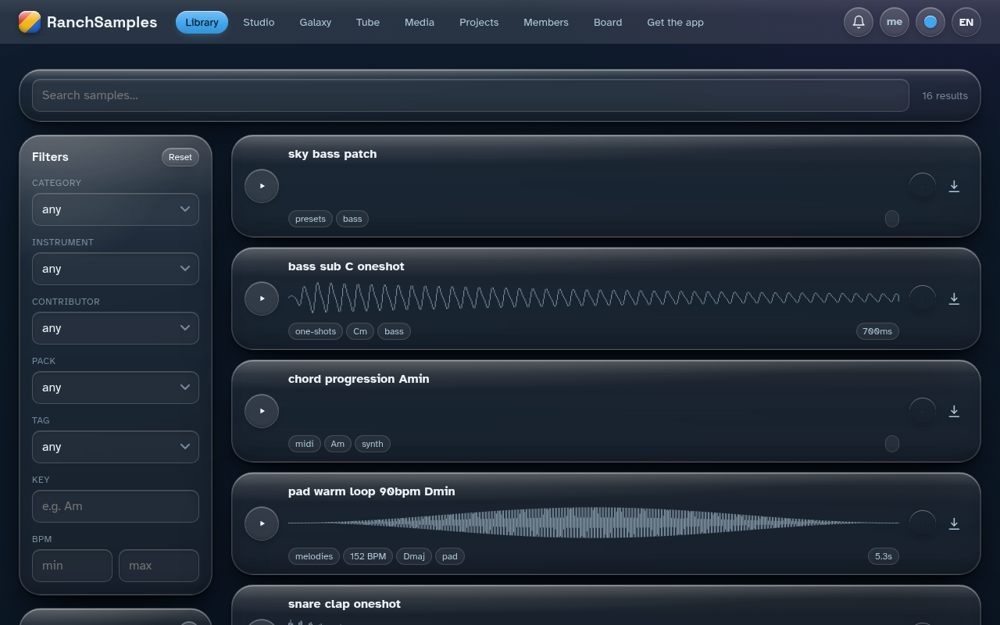 | 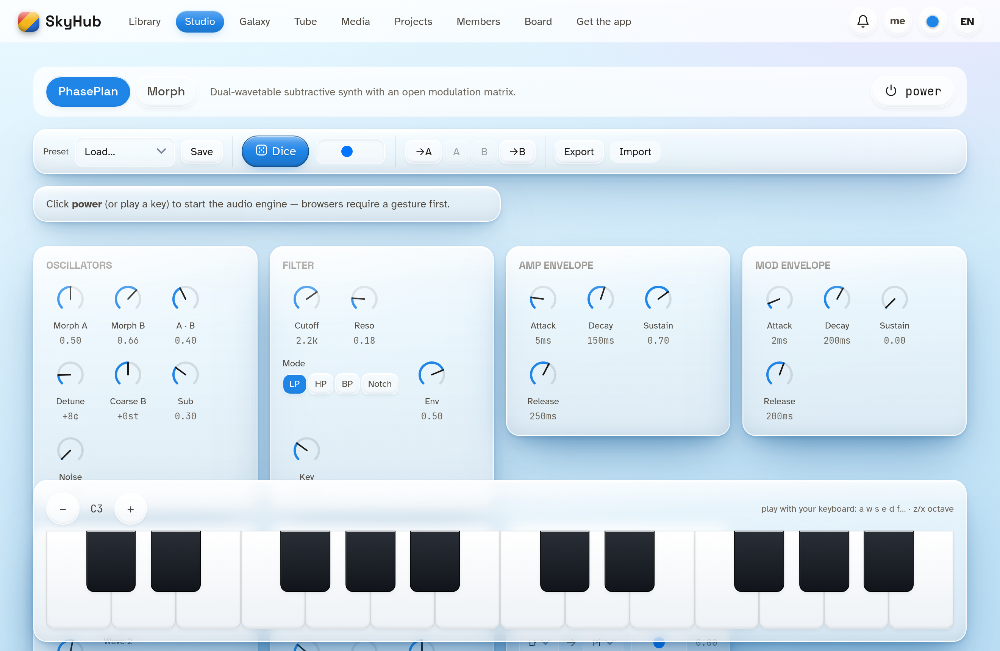 |
| **Library** — dark | **Studio** — light |

**On a phone — the same app, calm and complete:**

| | | |
|:--:|:--:|:--:|
| 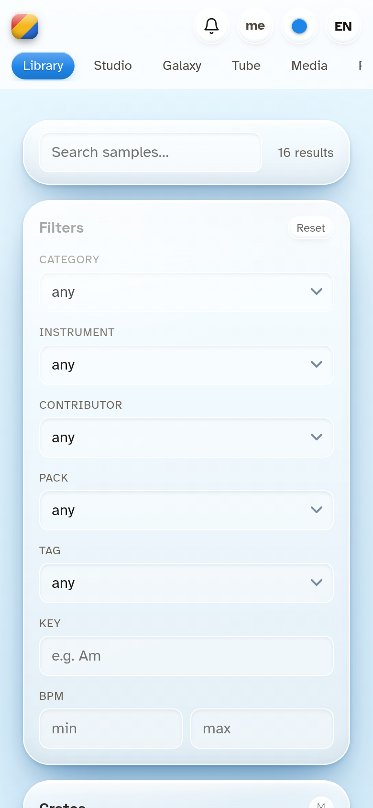 | 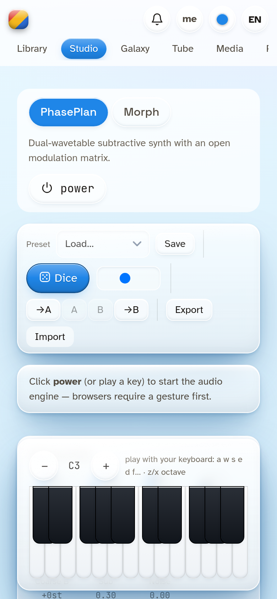 | 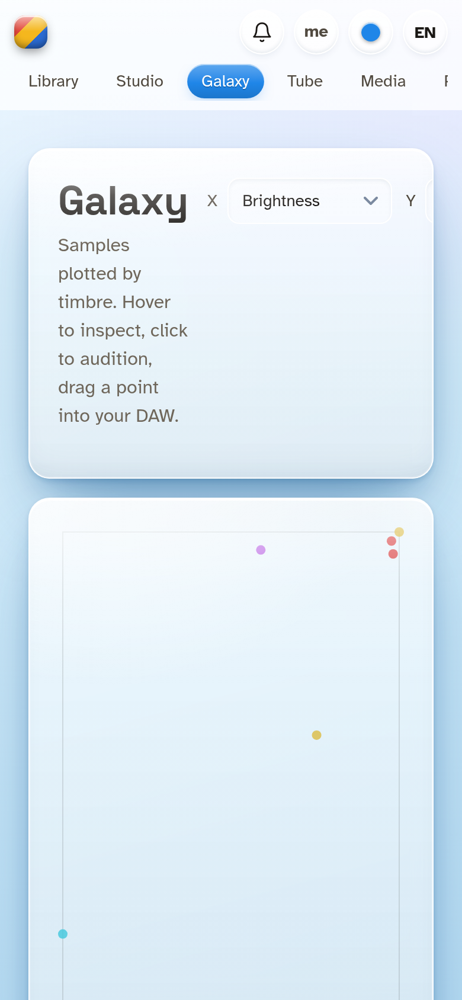 |
| **Library** | **Studio** | **Galaxy** |
| 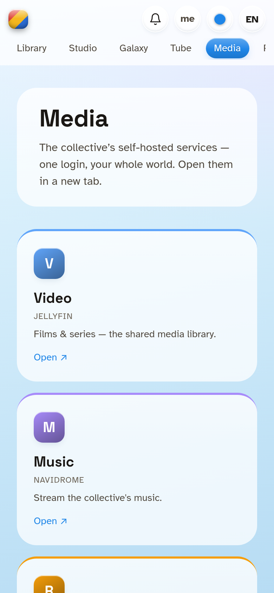 | 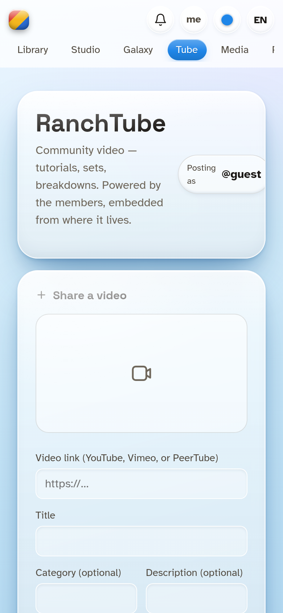 | 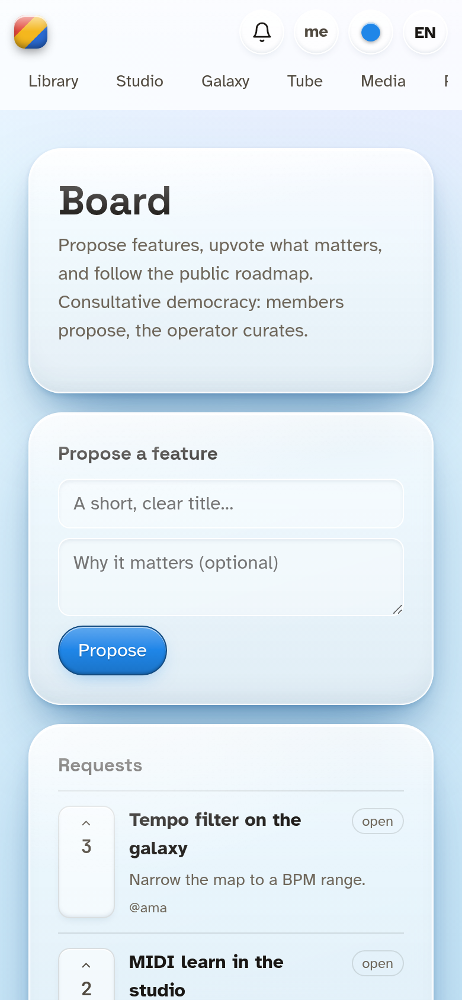 |
| **Media** | **Tube** | **Board** |

<sub>Captured in English; every surface ships `aero-light` / `aero-dark` plus user-chosen palettes and a custom accent. More in [`docs/screenshots/`](docs/screenshots/).</sub>

<div align="center">

**Find it fast** — search and filter the whole library, instantly.

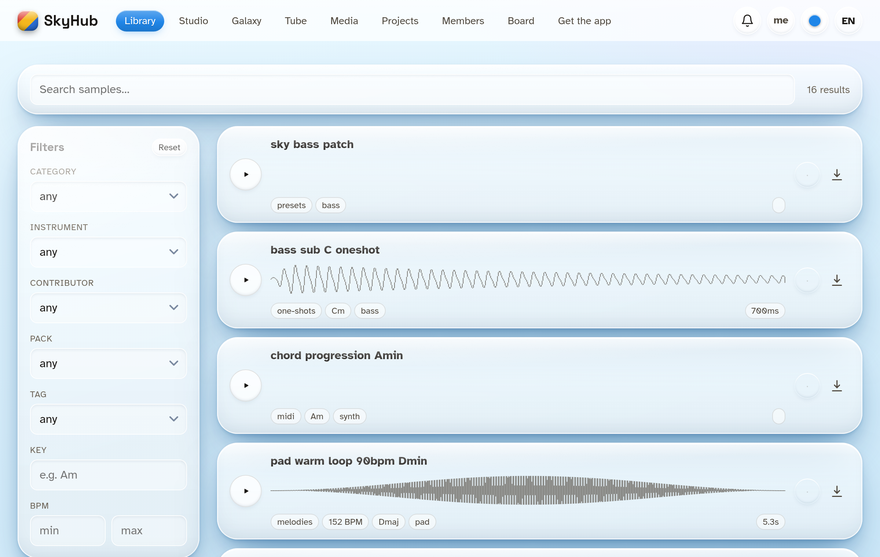

</div>

<div align="center">

**Make it yours** — six palettes, a fully custom accent, light/dark, and saved themes, all per-member.

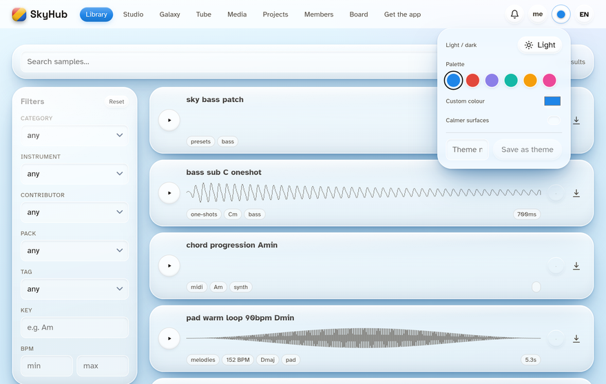

</div>

## Surfaces

- **Web app** (`apps/web`) — SvelteKit compiled to static files (no Node runtime in prod,
  CSP-strict). Browse / search / preview / organize into collections, community board,
  the studio (instruments running in an AudioWorklet via WebAssembly).
- **API** (`services/api`) — a single FastAPI service over a SQLite catalog.
- **Worker** (`services/worker`) — Python/librosa audio analysis (BPM, key, timbre) + ingest.
- **DSP core** (`crates/dsp-core`) — real-time-safe Rust primitives, compiled **once** to
  both WebAssembly (the web studio) and native plugins (VST3/CLAP via `nih-plug`).
- **Instruments** (`crates/morph`, `crates/phaseplan`) — built on `dsp-core`.
- **Desktop** (`crates/desktop`) — a Tauri shell whose reason to exist is reliable
  drag-into-DAW (a real local library folder + a native-drag enhancement layer).

> **Roadmap:** because the DSP is one portable Rust core, the same instruments are
> planned for more native targets — a **Max for Live** device (Max external over the
> core's C ABI) alongside the existing VST3/CLAP and WebAssembly builds.

## Community — owned by the SkyCloudCollective

SkyHub is **community-owned and operator-curated** — the platform of the **SkyCloudCollective**,
a small community of musicians and builders. The collaboration lives *in the product*, not bolted on:

- **The Board** (`/board`) — members **propose** ideas and **upvote** them (one vote each); the
  board sorts by support and the roadmap is public. *Consultative democracy*: upvotes inform, the
  operator curates ([`GOVERNANCE.md`](GOVERNANCE.md)).
- **Projects — a "GitHub of music"** (`/projects`) — collaborate on a body of work: **roles**
  (owner / editor / viewer), consented in-app **invitations**, a **files** index, an **activity log**
  ("git log"), and threaded **comments**.
- **Members & channels** (`/members`, `/u/<handle>`) — a profile per member (bio, avatar, links)
  with their own **channel** of contributions; **follow** the people whose work you like.
- **Tube — the video wall** (`/tube`) — members post videos with **comments** and **reactions**.
- **Crates** (`/crate`) — gather samples into shareable collections, drag-to-build.
- **One identity** — sign in once; the same account works across the collective's self-hosted services.

Be good to each other ([`CODE_OF_CONDUCT.md`](CODE_OF_CONDUCT.md)); here's how to
[contribute](CONTRIBUTING.md). Open (public) contribution is gated in code (`RS_OPEN_UGC`) until a
consent/legal review — **private and unlisted collaboration are always on**.

| | |
|:--|:--|
| 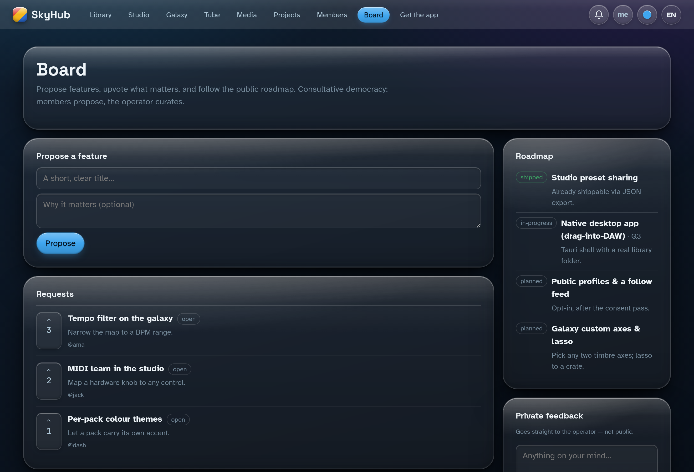 |  |
| **The Board** — propose, upvote, a public roadmap | **Members** — profiles, channels, follow |
| 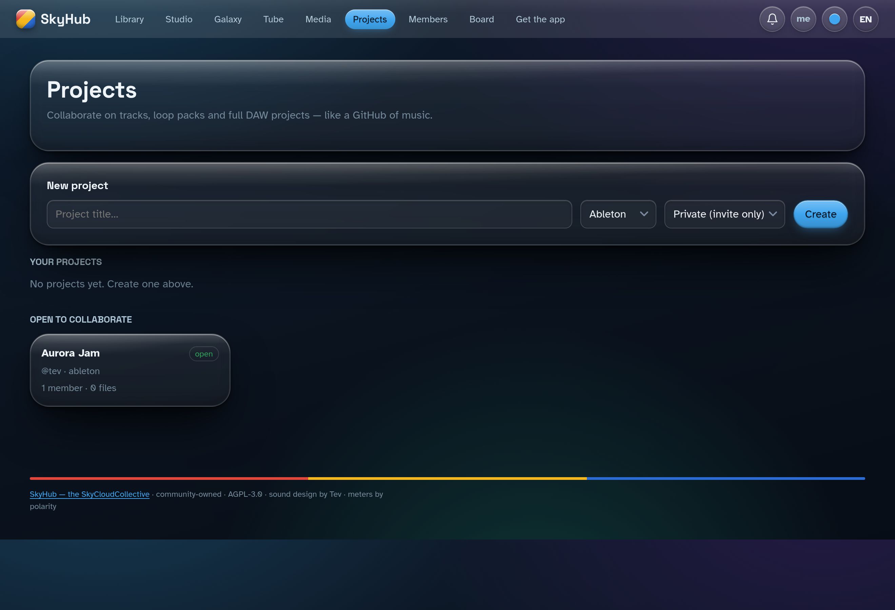 | 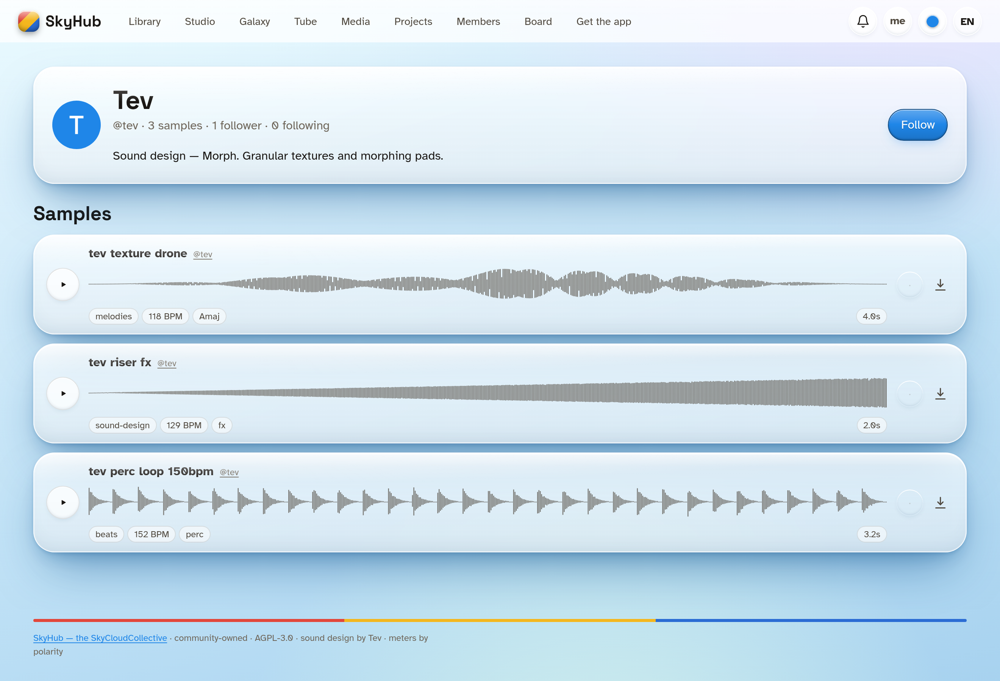 |
| **Projects** — collaborate, "a GitHub of music" | **Profiles** — each member's own channel |

## Principles

- **One source of truth.** The DSP is one Rust core, not a JS copy and a Rust copy. The
  backend is one server, not two kept in lockstep.
- **Accessibility first.** Calm UI, high legibility (Lexend / Atkinson Hyperlegible), warm
  near-black, AA+ contrast, `prefers-reduced-motion` honoured, no alarm iconography.
- **Self-hostable & auditable.** Static frontend, single SQLite file, reproducible builds,
  artifact residue audits. No SaaS dependency.
- **Original work.** The instruments are *inspired by* well-known tools but contain no
  third-party code or assets. Sound-design credit: **Tev**. Meters: **polarity** (MIT).

## Layout

```
crates/      Rust workspace: dsp-core, instruments, wasm bindings, plugins, desktop, xtask
apps/web/    SvelteKit (adapter-static) frontend
services/    api (FastAPI) + worker (Python analyzer/ingest)
packages/    tokens (design system) + api-types (generated)
db/          canonical schema + forward-only migrations
tests/       api integration, dsp golden-render, e2e smoke
ops/ ci/     deployment units + build/audit pipeline
docs/        architecture, ADRs, security, operations
```

## Build

A single task runner (`just`) fronts every toolchain:

```sh
just setup     # install/sync toolchains (rust, node, python)
just dev       # run api + web in watch mode
just test      # cargo test + pytest + golden renders
just build     # web (static) + plugins + desktop bundles
just audit     # residue scan on built artifacts
```

## Self-hosting

The whole platform is one FastAPI process over a single SQLite file + a prebuilt
static web app — no SaaS, no database server, no Node runtime in production. A
minimal instance is one command; a production instance is Caddy + uvicorn on one
origin. See [`SELFHOST.md`](SELFHOST.md).

## License & credits

GNU AGPL-3.0-or-later. Network use is distribution: a hosted instance must offer its
source. See [`LICENSE`](LICENSE).

The instruments and UI are original work, inspired by well-known tools but containing no
third-party code or assets except where attributed. Sound design (Morph): **Tev**.
Meters / scopes draw on **polarity** (Robert Agthe), MIT. Full attributions in
[`NOTICE`](NOTICE).
